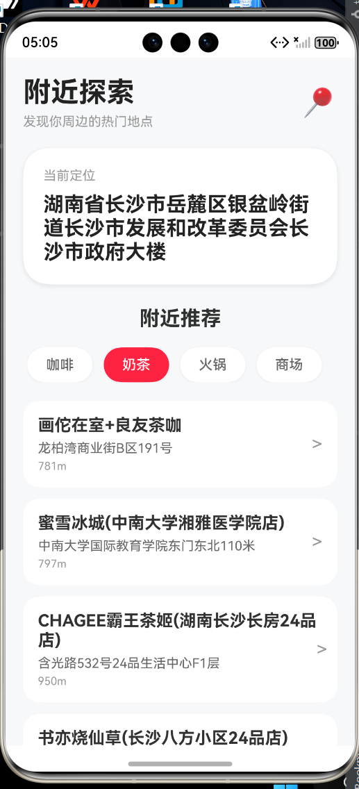

[HarmonyDeliveryTracker.md](https://github.com/user-attachments/files/27951857/HarmonyDeliveryTracker.md)
# HarmonyDeliveryTracker

## 📍 基于 HarmonyOS NEXT 的智能位置追踪应用

一款基于 HarmonyOS NEXT + ArkTS 开发的周边商圈探索应用。
通过高德地图开放 API 实现地址解析、周边 POI 搜索、分类切换等功能，模拟真实移动端地图类产品开发流程。

------

# 📱 项目预览

## 首页效果

- 当前定位地址解析
- 周边热门商圈推荐
- 分类切换
- Skeleton 骨架屏加载
- 小红书风格 UI 卡片

建议在这里放你的项目截图：





------

# ✨ 功能特性

## 📌 地址解析

通过高德地图逆地理编码 API：

```txt
经纬度 → 人类可读地址
```

例如：

```txt
112.9388,28.2282
↓
长沙市岳麓区拓维信息系统股份有限公司
```

------

## 🗺️ 周边 POI 搜索

支持搜索：

- ☕ 咖啡
- 🧋 奶茶
- 🍜 火锅
- 🏪 商场

并实时展示附近推荐列表。

------

## 🎨 小红书风 UI

采用：

- 大圆角
- 卡片阴影
- 渐变留白
- 轻量化布局

提升页面产品感。

------

## ⚡ Skeleton 骨架屏

在接口加载期间：

- 展示骨架屏
- 避免白屏等待
- 提升用户体验

------

## 🔄 分类切换

支持：

```txt
咖啡 → 奶茶 → 火锅 → 商场
```

动态切换并重新请求 POI 数据。

------

# 🛠️ 技术栈

| 技术                  | 说明                |
| --------------------- | ------------------- |
| HarmonyOS NEXT        | 鸿蒙开发平台        |
| ArkTS                 | 鸿蒙主开发语言      |
| ArkUI                 | 鸿蒙 UI 框架        |
| TypeScript            | 类型安全开发        |
| 高德地图 API          | 地址解析与 POI 搜索 |
| Promise / async-await | 异步请求            |
| Git Flow              | 企业级 Git 协作流程 |

------

# 📂 项目结构

```txt
entry/src/main/ets
├── api
│   └── amap.ts               // 高德 API
├── components
│   └── PoiCard.ets           // 商铺卡片组件
├── pages
│   └── HomePage.ets          // 首页
├── utils
│   └── request.ts            // request 封装
```

------

# 🚀 核心技术实现

## 1️⃣ 高德地图 API 接入

实现：

- 逆地理编码
- 周边 POI 搜索

封装统一 request 请求。

------

## 2️⃣ 组件化开发

将页面拆分为：

```txt
页面
↓
组件
↓
组件
```

提高代码可维护性。

------

## 3️⃣ 响应式状态管理

使用：

```ts
@State
```

实现：

- 分类切换
- loading 状态
- 列表更新

------

## 4️⃣ Skeleton 骨架屏

通过：

```ts
@Builder
```

构建加载占位 UI。

------

## 5️⃣ Git 企业协作演练

模拟多人开发流程：

- feature 分支开发
- dev 分支合并
- merge conflict 冲突解决
- Git Flow 工作流

------

# 📦 安装运行

## 克隆项目

```bash
git clone 你的仓库地址
```

------

## 打开项目

使用：

```txt
DevEco Studio
```

打开项目。

------

## 配置高德 Key

在：

```txt
api/amap.ts
```

中替换：

```ts
const AMAP_KEY = '你的高德key'
```

------

## 运行项目

连接：

- HarmonyOS 模拟器
- HarmonyOS NEXT 真机

点击运行即可。

------

# 📖 学习收获

通过本项目学习了：

- HarmonyOS NEXT 基础开发
- ArkTS 类型系统
- 第三方地图 API 接入
- 移动端 UI 设计
- Skeleton 骨架屏
- Git 企业协作
- Merge Conflict 冲突解决
- Promise 异步开发

------

# 📸 项目截图建议

建议上传：

| 截图         | 内容     |
| ------------ | -------- |
| 首页         | 地址解析 |
| 分类切换     | 不同 POI |
| Skeleton     | 加载效果 |
| Git 提交记录 | Git Flow |

------

# 🌟 项目亮点

✅ HarmonyOS NEXT 实战项目
✅ 高德地图 API 接入
✅ 企业级 Git Flow 演练
✅ 小红书风 UI 设计
✅ Skeleton 骨架屏
✅ TypeScript 强类型开发
✅ 响应式状态管理

------

# 📌 后续优化方向

-  真机实时定位
-  地图 Marker 打点
-  搜索历史
-  收藏功能
-  深色模式
-  动态主题
-  动画过渡
-  下拉刷新

------

# 👨‍💻 作者

前端开发学习项目。
持续学习 HarmonyOS NEXT 与移动端开发中。

------

# ⭐ Star

如果这个项目对你有帮助，欢迎 Star 支持一下～
